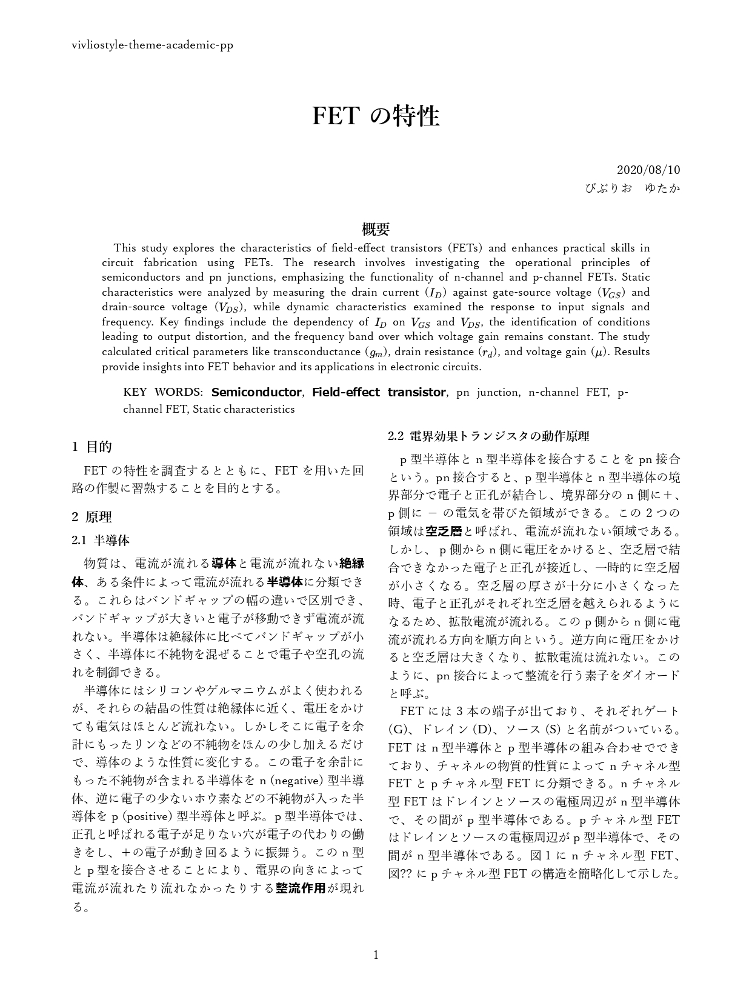
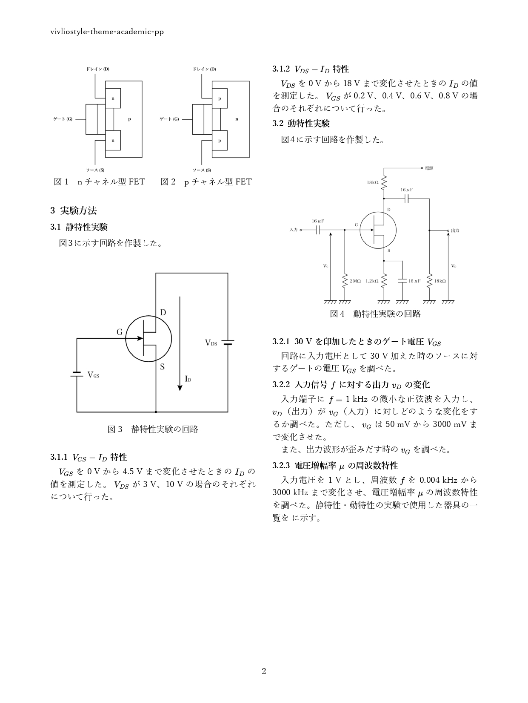

# Vivliostyle Theme Academic PP

[](https://npmjs.com/package/vivliostyle-theme-academic-pp)
[](https://npmjs.com/package/vivliostyle-theme-academic-pp)


An academic theme for Vivliostyle

<div style="display:flex; justify-content: space-between;">
  
  
</div>

## Functions

- Two-Column Layout
- Image Row
- Abstract
- KeyWords
- Enable / Disable Page Counter
- Enanle / Disable Abstract Title
- Font Selection
- Compact Mode

See Feature Details: (In Progress)

## Docs

Here's the document link! ↓

https://pocopota.github.io/vs-theme-academic-pp-docs/

## Use

In `vivliostyle.config.js`:

```js
module.exports = {
  theme: 'vivliostyle-theme-academic-pp',
};
```

If you want to add your CSS:

```js
module.exports = {
  theme: [
    'vivliostyle-theme-academic-pp',
    // add your CSS 
  ],
};
```

## Dev

### Files

```
vivliostyle-theme-academic-pp
├── LICENSE
├── README.md
├── example
│   ├── assets                            // auto generated
│   └── default.md                        // 🖋
├── package.json
├── theme.css                             // 🖋
└── vivliostyle.config.js
```

**example**: Contain sample manuscripts using your theme.

### Commands

Run `vivliostyle preview` to preview your `theme.css`.

To watch file changes, use `preview` script.

```bash
npm run preview
# or
yarn preview
```

You can specify your CSS file and manuscript file for preview in vivliostyle.config.js:

```js
module.exports = {
  language: 'en',
    theme: [
    'node_modules/@vivliostyle/theme-base',
    'node_modules/@vivliostyle/theme-academic',
    '.'
  ],
  entry: [
      'example/default.md',
      // and more...
  ],
}
```

Run `vivliostyle-theme-scripts validate` before publishing your package.

```bash
npm run validate
# or
yarn validate
```
